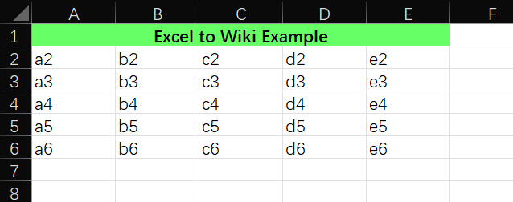
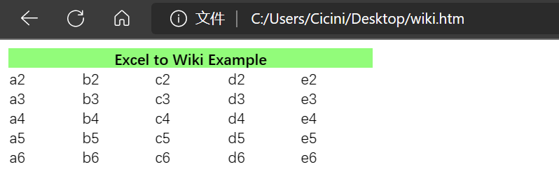
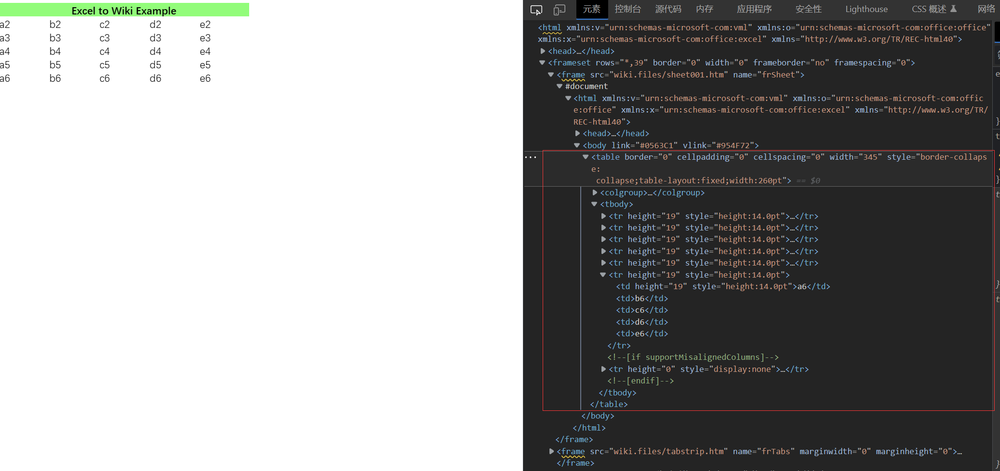
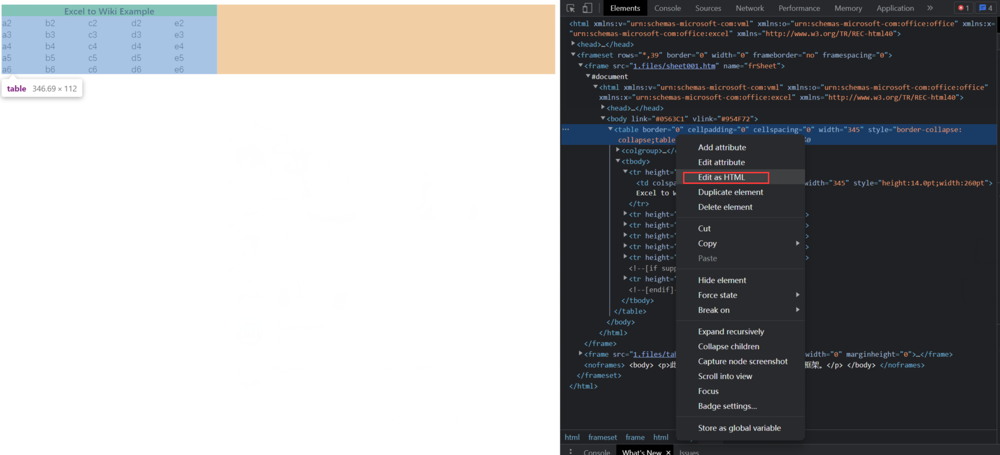

### How to use Excel to make a table and import it to the page?

Use The Recommend Automatic Tools:
https://github.com/fanfeilong/exceltk

Or

1.Create tables using Excel.



2.Save as web page file (HTML/HTM).


3.Open the saved HTML/HTM file with a browser. Then right click anywhere in the table and click "Inspect"



4.Find the line containing <table> in the right window.
  


5.Right-click where the <table> is located and select Edit as HTML.
  

  
6.Select all the content of the edit box and copy it to the place where you want to insert the table.


7.Delete the content from ` <!--[if supportMisalignedColumns]-->` to ` <!--[endif]-->`.
  
!>If you want to center the title, add `align="center"` to the `<td>` of the title. Also you can add `bgcolor="{rgb_code}"` to the `<td>` for Back Ground Color and add `style="color:{rgb_code}"` to the `<td>` for Text Color.

!>Don't worry about `width=*` `style="width:*` `height=*` `style="height:*"` will limit the size of the cell, if you modify the text content and the cell cannot accommodate the text content , the cell will be automatically resized so that the display of the table is no problem.
  
Original:

```
<table border="0" cellpadding="0" cellspacing="0" width="345" style="border-collapse:
 collapse;table-layout:fixed;width:260pt">
 <colgroup><col width="69" span="5" style="width:52pt">
 </colgroup><tbody><tr height="19" style="height:14.0pt">
  <td colspan="5" height="19" class="xl65" width="345" style="height:14.0pt;width:260pt">Excel
  to Wiki Example</td>
 </tr>
 <tr height="19" style="height:14.0pt">
  <td height="19" style="height:14.0pt">a2</td>
  <td>b2</td>
  <td>c2</td>
  <td>d2</td>
  <td>e2</td>
 </tr>
 <tr height="19" style="height:14.0pt">
  <td height="19" style="height:14.0pt">a3</td>
  <td>b3</td>
  <td>c3</td>
  <td>d3</td>
  <td>e3</td>
 </tr>
 <tr height="19" style="height:14.0pt">
  <td height="19" style="height:14.0pt">a4</td>
  <td>b4</td>
  <td>c4</td>
  <td>d4</td>
  <td>e4</td>
 </tr>
 <tr height="19" style="height:14.0pt">
  <td height="19" style="height:14.0pt">a5</td>
  <td>b5</td>
  <td>c5</td>
  <td>d5</td>
  <td>e5</td>
 </tr>
 <tr height="19" style="height:14.0pt">
  <td height="19" style="height:14.0pt">a6</td>
  <td>b6</td>
  <td>c6</td>
  <td>d6</td>
  <td>e6</td>
 </tr>
 <!--[if supportMisalignedColumns]-->
 <tr height="0" style="display:none">
  <td width="69" style="width:52pt"></td>
  <td width="69" style="width:52pt"></td>
  <td width="69" style="width:52pt"></td>
  <td width="69" style="width:52pt"></td>
  <td width="69" style="width:52pt"></td>
 </tr>
 <!--[endif]-->
</tbody></table>
```
  
Edited:

```
<table border="0" cellpadding="0" cellspacing="0" width="345" style="border-collapse:
 collapse;table-layout:fixed;width:260pt">
 <colgroup><col width="69" span="5" style="width:52pt">
 </colgroup><tbody><tr height="19" style="height:14.0pt">
  <td align="center" bgcolor="#ff6666" style="color:#ffffff" colspan="5" height="19" class="xl65" width="345" style="height:14.0pt;width:260pt">Excel
  to Wiki Example</td>
 </tr>
 <tr height="19" style="height:14.0pt">
  <td height="19" style="height:14.0pt">a2</td>
  <td>b2</td>
  <td>c2</td>
  <td>d2</td>
  <td>e2</td>
 </tr>
 <tr height="19" style="height:14.0pt">
  <td height="19" style="height:14.0pt">a3</td>
  <td>b3</td>
  <td>c3</td>
  <td>d3</td>
  <td>e3</td>
 </tr>
 <tr height="19" style="height:14.0pt">
  <td height="19" style="height:14.0pt">a4</td>
  <td>b4</td>
  <td>c4</td>
  <td>d4</td>
  <td>e4</td>
 </tr>
 <tr height="19" style="height:14.0pt">
  <td height="19" style="height:14.0pt">a5</td>
  <td>b5</td>
  <td>c5</td>
  <td>d5</td>
  <td>e5</td>
 </tr>
 <tr height="19" style="height:14.0pt">
  <td height="19" style="height:14.0pt">a6</td>
  <td>b6</td>
  <td>c6</td>
  <td>d6</td>
  <td>e6</td>
 </tr>
</tbody></table>
```
  
Sample:

<table border="0" cellpadding="0" cellspacing="0" width="345" style="border-collapse:
 collapse;table-layout:fixed;width:260pt">
 <colgroup><col width="69" span="5" style="width:52pt">
 </colgroup><tbody><tr height="19" style="height:14.0pt">
  <td align="center" bgcolor="#ff6666" style="color:#ffffff" colspan="5" height="19" class="xl65" width="345" style="height:14.0pt;width:260pt">Excel
  to Wiki Example</td>
 </tr>
 <tr height="19" style="height:14.0pt">
  <td height="19" style="height:14.0pt">a2</td>
  <td>b2</td>
  <td>c2</td>
  <td>d2</td>
  <td>e2</td>
 </tr>
 <tr height="19" style="height:14.0pt">
  <td height="19" style="height:14.0pt">a3</td>
  <td>b3</td>
  <td>c3</td>
  <td>d3</td>
  <td>e3</td>
 </tr>
 <tr height="19" style="height:14.0pt">
  <td height="19" style="height:14.0pt">a4</td>
  <td>b4</td>
  <td>c4</td>
  <td>d4</td>
  <td>e4</td>
 </tr>
 <tr height="19" style="height:14.0pt">
  <td height="19" style="height:14.0pt">a5</td>
  <td>b5</td>
  <td>c5</td>
  <td>d5</td>
  <td>e5</td>
 </tr>
 <tr height="19" style="height:14.0pt">
  <td height="19" style="height:14.0pt">a6</td>
  <td>b6</td>
  <td>c6</td>
  <td>d6</td>
  <td>e6</td>
 </tr>
</tbody></table>
