<h2>Enemy List</h2>

### Small Monsters

>#### Slime

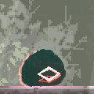

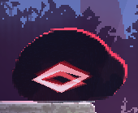

This monster will slowly slither towards the player whenever they enter its attack range，and attempt to damage them by either `pouncing` onto them or try to restrain them by `attaching` itself onto Noel's body at formidable `speed`. While weak on its own and can be easily disposed of, a swarm of them can easily overwhelm their target and corner them with the aforementioned `grabs` and `pounces`. Players can take them out safely with ground bombs and `white arrow` in the early game.

>#### Mushroom

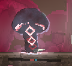

This monster will enter `guard` mode when the player `approaches` , and release sleeping gas with `gas bombs` in long range engagements. `Shotgunning` can take out a `guarding` mushroom with ease. When it is running low on `mana`, it will try to `pluck` out surrounding magical plants and absorb the mana resided within， and continues disrupting the player with `gas bombs` once revitalized.

>#### Porifera

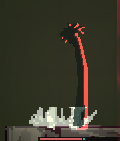

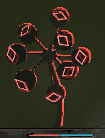

This close cousin of mushrooms will defend themselves with `tornado` and slowly `close in onto the player` when being pursued. `Tornado` can inflict `confusion`， and has great vertical reach. It also has the ability to `heal its allies` if left ignored. it is extremely vulnerable to `shotgunning`.

>#### Urchin

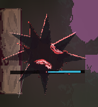

The surprisingly common urchin will hover in mid-air and can deal direct damage upon `contact`， and will fire `spikes` at random intervals. Even though shielding can keep them at bay without hassle, players can be heavily wounded and knocked back by urchins' surprise `dash attack` if they let their guard down. Each of their attacks costs a vast portion of their mana， but they will actively seek out magical plants to refill their stamina when they have almost exhausted their `mana`.

>#### Puppy

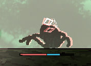

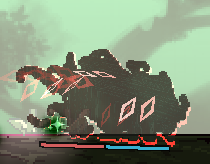

Even though this monster has a lovable name, it is a repulsive abomination mainly composed of tentacles and infested with worms. It shifts across the battleground with `swiftness` and moves `erratically`， so it can be challenging to land spells such as the white arrow on this monster. Sometimes, it may pounce forward and attempt to `restrain` the player like a playful dog. When it successfully pins down the player, it will extend its tentacles and `absorb mana` from its victim. If Noel has her limbs held in place by `multiple monsters` during the attack， players can only watch while Noel's legs are being shamefully pried apart and having her body toyed and tainted by the monsters; It becomes `near impossible to break free` once that occurs. When their body `swells up` and is wrapped around by worms, any damage they receive will be nullified as only their mana pool will be damaged instead of their actual health in that state. It is possible to one-shot them with `energy ball` as it does two hits, one from the `direct impact`, and one from the `explosion`.

>#### Puppet

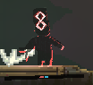

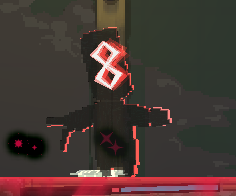

A tiny monster that reassembles a puppet. It will get close to the player and `hurl rocks` at them. But the projectile cannot reach some high-up places，it may even `trip and fall` on uneven terrains. They will `die on spot` whenever their mana is `depleted`. It will make different kinds of machinery, such as Homing Missile, ice、electric、Flame、thrower, Wooden Horse, jamming bit. If the puppet takes damage during the production process, the machine's production can be interrupted. Once completed, it will act as an enemy.

### Large Monsters

>#### Contaminated Slime

A slime that is greatly enlarged and strengthened due to contamination. `Swallowing` will be its primary method of attacking at close range while going for aggressive `ground pounds` in longer ranges that is capable of dealing a massive chunk of damage if the player is being cornered. If the player `fails to get away` after being held by this monster, Noel will be `vored alive` and may have a chance to be incubated. When incubated, eggs may be hatched and forced out of Noel's womb if the player frequently casts spells while this status is active. The player will be entirely `halted` when the slimes are being discharged from Noel, which can put them in grave danger when in combat.

>#### Contaminated Puppet

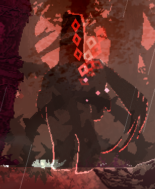

A.K.A The Golem. Its large body frame naturally means that it poses more threat than its smaller brethren. Even though its attacks are as simplistic as swinging its `ginormous club` around， it is still a deadly enemy to Noel, who is considered physically weak and deemed incompetent in battles nonetheless. It still lacks reliable means to attack `straight up` despite its enhanced physique. However, it tends to avoid spawning in areas that have elevations between surfaces. It is especially dangerous when encountered in a flat, enclosed area.

>#### Ground Snake

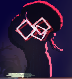

Covered in a `durable shell`， normal spells can `barely do any harm` to it. It can `deflect incoming spells` and attack with `tail whips`. It will also burrow into the ground， and tries to `restrain` the player from below. Since it cannot sense dangers above while buried， it can be baited out with `ground bombs` which can temporarily `stun` it， giving the player an opportunity to `attack`.

>#### Contaminated Urchin

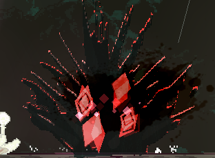

Instead of hovering, this enormous specimen of the urchin family has adapted to fighting on land by `moving along the surfaces`， and will `drop down onto` the player when being above them. The player will get `trapped` by its spikes if comes in direct contact while receiving continuous damage. The properties of this monster make it `inadvisable to get into close quarter engagements with it`, but its predictable pattern makes them susceptible to spells.

>#### Contaminated Mushroom

DETAWANE!! (THERE IT COMES!!)

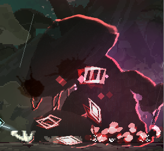

A gigantic mushroom under the effects of contamination， boasting its massive body and high agility brought by its `quick hops`， it can even `back step away` from the player. Its attacks consist of discharging high amount of `sleeping gas`, and `pouncing` in mid-ranges. Even though it does not have any destructive attacks in its arsenal， the player can be placed in danger when they come in contact with `red spore`, which contains `leech seeds` within and having their HP gradually drained. The only sensible course of action when infected by the spore is to try killing it quickly to avoid any further damage.

※ It got nerfed after the v0.20c patch due to its overwhelming power. ※ Even Hashino Mizuha, one of the game's developers, was defeated twice by this monster on the game-play test stream aired on 5/6.

>#### The Fool

A monster that travels across the `air`. Mainly relies on `lightning spell` for attacking. It will warp around to `evade incoming attacks and projectiles`. The lightning spell can be deflected back to the sender with `shield bash before being casted`， It will no longer warp whenever `its mana runs dry`, leaving it to the player's mercy.

>#### The Fire Fox

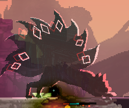

The closest thing one can get for a boss in the current build of this game as it is highly dangerous; Engage it at your peril. It is capable of converting its mana into flames and manipulating them for both defense and attack; Having the flame orbiting around it `like spirits` for protection, and fight by either `spewing fire` towards the player, or launching `magical napalms` that will leave behind a trail of fire which can `set Noel ablaze` after the initial explosion. It is not uncommon to see it disengage in combat and pluck magical plants, as most of its attacks consume a large amount of its mana.
