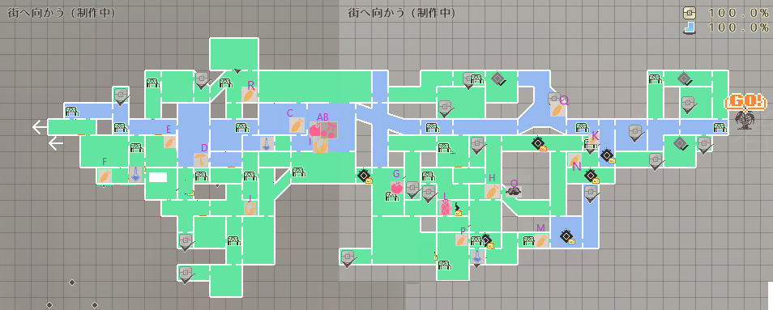

<h2>Gathering Locations</h2>

### Water

<table>
<tbody><tr class="atwiki_tr_odd atwiki_tr_1">		<td style="background-color:#CFC;text-align:center;">Item Name</td>
		<td style="background-color:#CFC;text-align:center;">Contents</td>
		<td style="background-color:#CFC;text-align:center;">Notes</td></tr>
<tr class="atwiki_tr_even atwiki_tr_2">		<td rowspan="5" style="vertical-align:MIDDLE;">Fresh Water </td>
		<td style="">Fresh Water★★x10</td>
		<td rowspan="5" style="vertical-align:MIDDLE;">Same across all locations with water</td></tr>
<tr class="atwiki_tr_odd atwiki_tr_3">
		<td style="">Fresh Water★★★x10</td>
</tr>
<tr class="atwiki_tr_even atwiki_tr_4">
		<td style="">Fresh Water★★x10</td>
</tr>
<tr class="atwiki_tr_odd atwiki_tr_5">
		<td style="">Fresh Water★★x10</td>
</tr>
<tr class="atwiki_tr_even atwiki_tr_6">
		<td style="">Fresh Water★★x10</td>
</tr>
</tbody></table>

### Tree、Ore

<table>
<tbody><tr class="atwiki_tr_odd atwiki_tr_1">		<td style="background-color:#CFC;text-align:center;">Location</td>
		<td style="background-color:#CFC;text-align:center;">Item Name</td>
		<td style="background-color:#CFC;text-align:center;">Contents</td></tr>
<tr class="atwiki_tr_even atwiki_tr_2">		<td rowspan="6" style="vertical-align:MIDDLE;">A</td>
		<td rowspan="6" style="vertical-align:MIDDLE;">Blood Cherry </td>
		<td style="">Blood Cherry★★x3</td></tr>
<tr class="atwiki_tr_odd atwiki_tr_3">
		<td style="">Blood Cherry★★x4</td></tr>
<tr class="atwiki_tr_even atwiki_tr_4">
		<td style="">Blood Cherry★★x3</td></tr>
<tr class="atwiki_tr_odd atwiki_tr_5">
		<td style="">Blood Cherry★★★x2</td></tr>
<tr class="atwiki_tr_even atwiki_tr_6">
		<td style="">Blood Cherry★★x3</td></tr>
<tr class="atwiki_tr_odd atwiki_tr_7">
		<td style="">Blood Cherry★x4</td></tr>
<tr class="atwiki_tr_even atwiki_tr_8">		<td rowspan="6" style="vertical-align:MIDDLE;">B</td>
		<td rowspan="6" style="vertical-align:MIDDLE;">Blood Apple</td>
		<td style="">Blood Apple★x2</td></tr>
<tr class="atwiki_tr_odd atwiki_tr_9">
		<td style="">Blood Apple★x3</td></tr>
<tr class="atwiki_tr_even atwiki_tr_10">
		<td style="">Blood Apple★x2</td></tr>
<tr class="atwiki_tr_odd atwiki_tr_11">
		<td style="">Blood Apple★x3</td></tr>
<tr class="atwiki_tr_even atwiki_tr_12">
		<td style="">Blood Apple★x3</td></tr>
<tr class="atwiki_tr_odd atwiki_tr_13">
		<td style="">Blood Apple★★x2</td></tr>
<tr class="atwiki_tr_even atwiki_tr_14">		<td rowspan="7" style="vertical-align:MIDDLE;">C</td>
		<td rowspan="7" style="vertical-align:MIDDLE;">Onion</td>
		<td style="">Onion★★x1</td></tr>
<tr class="atwiki_tr_odd atwiki_tr_15">
		<td style="">Onion★x2</td></tr>
<tr class="atwiki_tr_even atwiki_tr_16">
		<td style="">Onion★★x2</td></tr>
<tr class="atwiki_tr_odd atwiki_tr_17">
		<td style="">Onion★x1</td></tr>
<tr class="atwiki_tr_even atwiki_tr_18">
		<td style="">Onion★x2</td></tr>
<tr class="atwiki_tr_odd atwiki_tr_19">
		<td style="">Onion★x3</td></tr>
<tr class="atwiki_tr_even atwiki_tr_20">
		<td style="">Onion★x1</td></tr>
<tr class="atwiki_tr_odd atwiki_tr_21">		<td rowspan="7" style="vertical-align:MIDDLE;">D</td>
		<td rowspan="7" style="vertical-align:MIDDLE;">Mushroom</td>
		<td style="">Mushroom★★★★★x1</td></tr>
<tr class="atwiki_tr_even atwiki_tr_22">
		<td style="">Mushroom★x3</td></tr>
<tr class="atwiki_tr_odd atwiki_tr_23">
		<td style="">Mushroom★x1</td></tr>
<tr class="atwiki_tr_even atwiki_tr_24">
		<td style="">Mushroom★x5</td></tr>
<tr class="atwiki_tr_odd atwiki_tr_25">
		<td style="">Mushroom★x2</td></tr>
<tr class="atwiki_tr_even atwiki_tr_26">
		<td style="">Mushroom★x2</td></tr>
<tr class="atwiki_tr_odd atwiki_tr_27">
		<td style="">Mushroom★x1</td></tr>
<tr class="atwiki_tr_even atwiki_tr_28">		<td rowspan="7" style="vertical-align:MIDDLE;">E</td>
		<td rowspan="7" style="vertical-align:MIDDLE;">Carrot</td>
		<td style="">Carrot★x2</td></tr>
<tr class="atwiki_tr_odd atwiki_tr_29">
		<td style="">Carrot★★x2</td></tr>
<tr class="atwiki_tr_even atwiki_tr_30">
		<td style="">Carrot★x1</td></tr>
<tr class="atwiki_tr_odd atwiki_tr_31">
		<td style="">Carrot★★x1</td></tr>
<tr class="atwiki_tr_even atwiki_tr_32">
		<td style="">Carrot★x2</td></tr>
<tr class="atwiki_tr_odd atwiki_tr_33">
		<td style="">Carrot★x3</td></tr>
<tr class="atwiki_tr_even atwiki_tr_34">
		<td style="">Carrot★x1</td></tr>
<tr class="atwiki_tr_odd atwiki_tr_35">		<td rowspan="7" style="vertical-align:MIDDLE;">F</td>
		<td rowspan="7" style="vertical-align:MIDDLE;">Lettuce</td>
		<td style="">Lettuce★★x2</td></tr>
<tr class="atwiki_tr_even atwiki_tr_36">
		<td style="">Lettuce★x3</td></tr>
<tr class="atwiki_tr_odd atwiki_tr_37">
		<td style="">Lettuce★x1</td></tr>
<tr class="atwiki_tr_even atwiki_tr_38">
		<td style="">Lettuce★x2</td></tr>
<tr class="atwiki_tr_odd atwiki_tr_39">
		<td style="">Lettuce★★x1</td></tr>
<tr class="atwiki_tr_even atwiki_tr_40">
		<td style="">Lettuce★x1</td></tr>
<tr class="atwiki_tr_odd atwiki_tr_41">
		<td style="">Lettuce★x2</td></tr>
<tr class="atwiki_tr_even atwiki_tr_42">		<td rowspan="8" style="vertical-align:MIDDLE;">G</td>
		<td rowspan="8" style="vertical-align:MIDDLE;">Blood Cherry 、Blood Apple</td>
		<td style="">Blood Cherry★★x4</td></tr>
<tr class="atwiki_tr_odd atwiki_tr_43">
		<td style="">Blood Apple★★x2</td></tr>
<tr class="atwiki_tr_even atwiki_tr_44">
		<td style="">Blood Cherry★★x3</td></tr>
<tr class="atwiki_tr_odd atwiki_tr_45">
		<td style="">Blood Apple★x2</td></tr>
<tr class="atwiki_tr_even atwiki_tr_46">
		<td style="">Blood Apple★x3</td></tr>
<tr class="atwiki_tr_odd atwiki_tr_47">
		<td style="">Blood Cherry★★x3</td></tr>
<tr class="atwiki_tr_even atwiki_tr_48">
		<td style="">Blood Apple★x3</td></tr>
<tr class="atwiki_tr_odd atwiki_tr_49">
		<td style="">Blood Apple★x2</td></tr>
<tr class="atwiki_tr_even atwiki_tr_50">		<td rowspan="7" style="vertical-align:MIDDLE;">H</td>
		<td rowspan="7" style="vertical-align:MIDDLE;">Beets</td>
		<td style="">Beets★★x2</td></tr>
<tr class="atwiki_tr_odd atwiki_tr_51">
		<td style="">Beets★★x1</td></tr>
<tr class="atwiki_tr_even atwiki_tr_52">
		<td style="">Beets★x1</td></tr>
<tr class="atwiki_tr_odd atwiki_tr_53">
		<td style="">Beets★x2</td></tr>
<tr class="atwiki_tr_even atwiki_tr_54">
		<td style="">Beets★x1</td></tr>
<tr class="atwiki_tr_odd atwiki_tr_55">
		<td style="">Beets★x2</td></tr>
<tr class="atwiki_tr_even atwiki_tr_56">
		<td style="">Beets★x3</td></tr>
<tr class="atwiki_tr_odd atwiki_tr_57">		<td rowspan="6" style="vertical-align:MIDDLE;">I</td>
		<td rowspan="6" style="vertical-align:MIDDLE;">Ore</td>
		<td style="">Quartz★★x1</td></tr>
<tr class="atwiki_tr_even atwiki_tr_58">
		<td style="">Amethyst★x1</td></tr>
<tr class="atwiki_tr_odd atwiki_tr_59">
		<td style="">Coal★x2</td></tr>
<tr class="atwiki_tr_even atwiki_tr_60">
		<td style="">Coal★x3</td></tr>
<tr class="atwiki_tr_odd atwiki_tr_61">
		<td style="">Quartz★x1</td></tr>
<tr class="atwiki_tr_even atwiki_tr_62">
		<td style="">Coal★★x2</td></tr>
<tr class="atwiki_tr_odd atwiki_tr_63">		<td rowspan="7" style="vertical-align:MIDDLE;">J</td>
		<td rowspan="7" style="vertical-align:MIDDLE;">Ore</td>
		<td style="">Amethyst★x1</td></tr>
<tr class="atwiki_tr_even atwiki_tr_64">
		<td style="">Rock Salt★x2</td></tr>
<tr class="atwiki_tr_odd atwiki_tr_65">
		<td style="">Quartz★★x2</td></tr>
<tr class="atwiki_tr_even atwiki_tr_66">
		<td style="">Quartz★★x3</td></tr>
<tr class="atwiki_tr_odd atwiki_tr_67">
		<td style="">Coal★x4</td></tr>
<tr class="atwiki_tr_even atwiki_tr_68">
		<td style="">Rock Salt★x3</td></tr>
<tr class="atwiki_tr_odd atwiki_tr_69">
		<td style="">Coal★x3</td></tr>
<tr class="atwiki_tr_even atwiki_tr_70">		<td rowspan="7" style="vertical-align:MIDDLE;">K</td>
		<td rowspan="7" style="vertical-align:MIDDLE;">Cucumber</td>
		<td style="">Cucumber★x3</td></tr>
<tr class="atwiki_tr_odd atwiki_tr_71">
		<td style="">Cucumber★x1</td></tr>
<tr class="atwiki_tr_even atwiki_tr_72">
		<td style="">Cucumber★x2</td></tr>
<tr class="atwiki_tr_odd atwiki_tr_73">
		<td style="">Cucumber★x1</td></tr>
<tr class="atwiki_tr_even atwiki_tr_74">
		<td style="">Cucumber★★x1</td></tr>
<tr class="atwiki_tr_odd atwiki_tr_75">
		<td style="">Cucumber★x2</td></tr>
<tr class="atwiki_tr_even atwiki_tr_76">
		<td style="">Cucumber★★x2</td></tr>
<tr class="atwiki_tr_odd atwiki_tr_77">		<td rowspan="5" style="vertical-align:MIDDLE;">L</td>
		<td rowspan="5" style="vertical-align:MIDDLE;">Blood Pine</td>
		<td style="">Blood Pine★x1</td></tr>
<tr class="atwiki_tr_even atwiki_tr_78">
		<td style="">Blood Pine★★x2</td></tr>
<tr class="atwiki_tr_odd atwiki_tr_79">
		<td style="">Blood Pine★★x1</td></tr>
<tr class="atwiki_tr_even atwiki_tr_80">
		<td style="">Blood Pine★★x2</td></tr>
<tr class="atwiki_tr_odd atwiki_tr_81">
		<td style="">Blood Pine★★x1</td></tr>
<tr class="atwiki_tr_even atwiki_tr_82">		<td rowspan="5" style="vertical-align:MIDDLE;">M</td>
		<td rowspan="5" style="vertical-align:MIDDLE;">Garlic</td>
		<td style="">Garlic★x3</td></tr>
<tr class="atwiki_tr_odd atwiki_tr_83">
		<td style="">Garlic★x2</td></tr>
<tr class="atwiki_tr_even atwiki_tr_84">
		<td style="">Garlic★★x2</td></tr>
<tr class="atwiki_tr_odd atwiki_tr_85">
		<td style="">Garlic★★x1</td></tr>
<tr class="atwiki_tr_even atwiki_tr_86">
		<td style="">Garlic★x1</td></tr>
<tr class="atwiki_tr_odd atwiki_tr_87">		<td rowspan="7" style="vertical-align:MIDDLE;">N</td>
		<td rowspan="7" style="vertical-align:MIDDLE;">Green Pepper</td>
		<td style="">Green Pepper★★x2</td></tr>
<tr class="atwiki_tr_even atwiki_tr_88">
		<td style="">Green Pepper★★x1</td></tr>
<tr class="atwiki_tr_odd atwiki_tr_89">
		<td style="">Green Pepper★x1</td></tr>
<tr class="atwiki_tr_even atwiki_tr_90">
		<td style="">Green Pepper★x2</td></tr>
<tr class="atwiki_tr_odd atwiki_tr_91">
		<td style="">Green Pepper★x1</td></tr>
<tr class="atwiki_tr_even atwiki_tr_92">
		<td style="">Green Pepper★x3</td></tr>
<tr class="atwiki_tr_odd atwiki_tr_93">
		<td style="">Green Pepper★x2</td></tr>
<tr class="atwiki_tr_even atwiki_tr_94">		<td rowspan="6" style="vertical-align:MIDDLE;">O</td>
		<td rowspan="6" style="vertical-align:MIDDLE;">Various Meat</td>
		<td style="">Gel★x4</td></tr>
<tr class="atwiki_tr_odd atwiki_tr_95">
		<td style="">Livestock Meat★x1</td></tr>
<tr class="atwiki_tr_even atwiki_tr_96">
		<td style="">Gel★★x2</td></tr>
<tr class="atwiki_tr_odd atwiki_tr_97">
		<td style="">Monster's Meat★x1</td></tr>
<tr class="atwiki_tr_even atwiki_tr_98">
		<td style="">Monster's Meat★x2</td></tr>
<tr class="atwiki_tr_odd atwiki_tr_99">
		<td style="">Monster's Liver★x1</td></tr>
<tr class="atwiki_tr_even atwiki_tr_100">		<td rowspan="7" style="vertical-align:MIDDLE;">P</td>
		<td rowspan="7" style="vertical-align:MIDDLE;">Paprika</td>
		<td style="">Paprika★x1</td></tr>
<tr class="atwiki_tr_odd atwiki_tr_101">
		<td style="">Paprika★x3</td></tr>
<tr class="atwiki_tr_even atwiki_tr_102">
		<td style="">Paprika★x2</td></tr>
<tr class="atwiki_tr_odd atwiki_tr_103">
		<td style="">Paprika★x2</td></tr>
<tr class="atwiki_tr_even atwiki_tr_104">
		<td style="">Paprika★x1</td></tr>
<tr class="atwiki_tr_odd atwiki_tr_105">
		<td style="">Paprika★★x2</td></tr>
<tr class="atwiki_tr_even atwiki_tr_106">
		<td style="">Paprika★★x1</td></tr>
<tr class="atwiki_tr_odd atwiki_tr_107">		<td rowspan="7" style="vertical-align:MIDDLE;">Q</td>
		<td rowspan="7" style="vertical-align:MIDDLE;">Turnip</td>
		<td style="">Turnip★x1</td></tr>
<tr class="atwiki_tr_even atwiki_tr_108">
		<td style="">Turnip★★x2</td></tr>
<tr class="atwiki_tr_odd atwiki_tr_109">
		<td style="">Turnip★x1</td></tr>
<tr class="atwiki_tr_even atwiki_tr_110">
		<td style="">Turnip★x2</td></tr>
<tr class="atwiki_tr_odd atwiki_tr_111">
		<td style="">Turnip★x2</td></tr>
<tr class="atwiki_tr_even atwiki_tr_112">
		<td style="">Turnip★★x1</td></tr>
<tr class="atwiki_tr_odd atwiki_tr_113">
		<td style="">Turnip★x3</td></tr>
<tr class="atwiki_tr_even atwiki_tr_114">		<td rowspan="7" style="vertical-align:MIDDLE;">R</td>
		<td rowspan="7" style="vertical-align:MIDDLE;">Eggplant</td>
		<td style="">Eggplant★★x1</td></tr>
<tr class="atwiki_tr_odd atwiki_tr_115">
		<td style="">Eggplant★x3</td></tr>
<tr class="atwiki_tr_even atwiki_tr_116">
		<td style="">Eggplant★x2</td></tr>
<tr class="atwiki_tr_odd atwiki_tr_117">
		<td style="">Eggplant★x2</td></tr>
<tr class="atwiki_tr_even atwiki_tr_118">
		<td style="">Eggplant★x1</td></tr>
<tr class="atwiki_tr_odd atwiki_tr_119">
		<td style="">Eggplant★x1</td></tr>
<tr class="atwiki_tr_even atwiki_tr_120">
		<td style="">Eggplant★★x2</td></tr>
</tbody></table>

