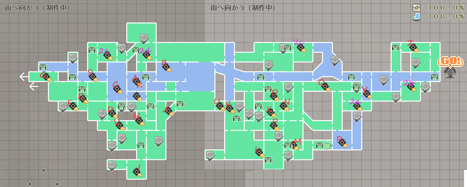

<h2>沸きポイント</h2>

| 場所 | 戦闘ポイント | 入手可能宝箱名 | 敵人 | 危険度 |
|---|---|---|---|---|
|A|木漏れ日の広間|穀物1|スライム|1|
|B|飛瀑の虚|甘味1|キノコ、剣山|2|
|C|胞子の踊り場|魔族素材1|スライム、キノコ|2|
|D|夕立|宝石1、綠野菜1|キノコ、スライム、土蛇|3|
|E|卑しき補給兵|いろいろ野菜1|海綿、キノコ、スライム|2|
|F|はぐれ者|肉類1、資材、？？？| スライム汚染体、スライム|3|
|G|鳥籠|フルーツ1|スライム、キノコ、剣山|1|
|H|盗掘者|鉱石1|木偶|2|
|I|土竜の巣|甘味1|土蛇|2|
|J|ドッグラン|肉類1|子犬、剣山|2|
|K|酸木のオードブル|穀物1、綠野菜1|キノコ、スライム、木偶、剣山|3|
|L|酸底の針鼠|魔族素材2、フルーツ2、キノコ1、？？？|剣山汚染体、剣山|4|
|M|頭上注意|宝石1、魔族素材1|木偶、海綿、子犬|3|
|N|菌系の王|甘味1、赤黃野菜1、キノコ1、？？？|キノコ汚染体、キノコ|4|
|O|からくり人形|魔族素材2、フルーツ2、いろいろ野菜1、？？？|木偶汚染体、海綿、木偶|4|
|P|流鏑馬の集い|穀物1、いろいろ野菜1|剣山、木偶、キノコ|3|
|Q|空中回廊|鉱石1、魔族素材3|キノコ、スライム、子犬|3|
|R|炎舞神楽|魔族素材2、甘味1、フルーツ2|妖狐、海綿、剣山|4|
|S|裂け目の番人(夜)|宝石1、魔族素材1、鉱石1|愚者、キノコ|3|
|T|血の制圧者(夜)|赤黃野菜1、魔族素材1|愚者、海綿|1|
|U|闇夜の帳(夜)|鉱石1|愚者、子犬|2|
|V|ジャックインザボックス(夜)|肉類1、ハーブ2、魔族素材1|愚者、土蛇|3|
|W|酸溜まりの奈落(夜)|鉱石1、赤黃野菜1、魔族素材2|愚者、木偶|3|
|X|湖面の蜃気楼(夜)|綠野菜1、赤黃野菜1、フルーツ1、鉱石1|愚者、スライム、剣山|4|

### 0.22追加 :id=022

| 場所 | 戰鬥點 | 入手可能寶箱名 | 敵人 | 危險度 |
|---|---|---|---|---|
|Y|古駅の夜宴(夜)|鉱石3、フルーツ2|愚者、海綿、トカゲ|3|
|Z|森のヌシ(ボス戦)|穀物1+、資材+、鉱石3、魔族素材3|森のヌシ|5|
|2a|蠱惑なる沼|ハーブ1|トカゲ、スライム、海綿|2|
|2b|継ぎ接ぎラボラトリー|鉱石2、鉱石3|木偶、スライム|3|
|2c|滑脱するの鶴和亀|綠野菜1、資材|トカゲ、剣山|3|
|2d|風のアトリウム|ハーブ1、ハーブ2|スライム、木偶、トカゲ|2|
|2e|貪欲なる溺惑|鉱石2、ハーブ2、魔族素材3|沼蛙、トカゲ、子犬|4|
