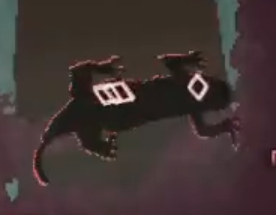
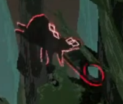

<h2>魔族一覽</h2>

### 小型魔族 :id=small

>#### 史萊姆 :id=slime

在一定的距離以內的話，會慢慢向著玩家移動，並使用`跳躍攻擊`或`吸收攻擊`。只有一隻史萊姆的時候可以輕鬆對付，但是當有一群的時候，可能會有被群體`吸收攻擊`和`跳躍攻擊`夾攻的危險，前期使用`球型炸彈`加上`純白之箭`來對付是比較安全的方法。

>#### 蘑菇 :id=mushroom

`靠近時`會縮起來呈`防禦狀態`，在遠距離時會使用`瓦斯彈`來釋放瓦斯。使用`散彈槍`可以輕鬆地對付`防禦狀態`中的蘑菇，當蘑菇`沒魔力時`會對附近的魔力植物`攻擊`並吸取其魔力，然後繼續放出`瓦斯彈`。

>#### 海綿 :id=porifera

放置不管時會投出自己的一部分幫`魔族同伴回復HP`。雖然牠有著害怕`散彈槍`攻擊的`弱點`，但是在靠近時會使用`龍捲攻擊`並持續`接近玩家`，`龍捲攻擊`附加`混亂`的效果，並且能攻擊到非常上面的範圍。

>#### 劍山 :id=urchin

意外地出現機率很高的刺刺，會在空中飄浮移動並且有直接`接觸傷害`，也會隨興放出帶有追蹤效果的{飛刺攻擊}，雖然只要用護盾彈開就能輕鬆處理，但是大意的話，可能會被突如而來的`突進攻擊`推飛並受到大量傷害。不管是哪一個攻擊都會消耗龐大的魔力，但是在`沒有魔力`時也會積極的去找魔力植物來`補充魔力`。

>#### 小狗 :id=puppy

有著可愛的名字，但是其實本體是身上纏著許多蟲子的噁心的觸手生物。有著`非常敏捷`而且`不規則的移動規律`，使用一開始的魔術純白之箭來命中是極為困難的事。有時會使用像是嬉鬧的小狗般的飛撲`拘束攻擊`，並使用觸手來`吸取玩家的魔力`，如果被`複數的敵人`綁住四肢的話，就會被狼狽的開腳並被玩弄的弱點，那時要`脫出會變得非常困難`。小狗在`肥大時`有蟲子纏在身上時，所受到的`攻擊`都只會先由`MP來承受`。`能量球`攻擊判定有`直擊`和`爆風兩次判定`，運用得好的話，說不定可以`一發擊倒`牠。

>#### 木偶 :id=puppet

小型像是人偶般的魔族。會靠近玩家並使出`投石攻擊`，但是有些高的地方就丟不到。移動時稍微有些高低差還會`跌倒`，`魔力耗盡時`會`原地死去` 
版本0.22以後會製造各種機器兵器三角木馬、火冰雷光束發射器、追蹤飛彈、雜訊無人機等... 
但製作完成後將會變為新的敵人參與戰鬥 
在製作完成之前將木偶擊破可以暫時停止進度，但是如果有新的木偶前來建造的話，進度是持續之前的

### 大型魔族 :id=large

>#### 史萊姆汙染體 :id=c-slime

汙染化的巨大史萊姆，`近距離`會使出`吞下攻擊`，`逃脫失敗`的話，會被`丸吞並機率性產卵`，被產卵以後如果過度使用魔力後將會產下史萊姆幼體的蛋，`出產途中無法動彈`非常危險。`遠距離`時會使出`上下撲擊`，在角落時可能會`遭受連續大量傷害`。

>#### 木偶汙染體 :id=c-puppet

汙染化的木偶，也俗稱巨人。與通常型態相比，體型突變得大也變得更具威脅性，雖然只是單調的揮動著`巨大棍棒的攻擊`，但是對諾艾爾般的後衛職的相性非常差。與通常型態的木偶一樣沒有可以`攻擊正上方的手段`，但是通常不太出現在有高低差的地形，特別是在平地又狹小的地方，更能體會到其危險的戰鬥力。
土蛇

>#### 土蛇 :id=ground-snake

有著`堅硬的外殼`，通常魔術幾乎`造成不了多少傷害`，會將`魔術彈開`和使用`尾巴攻擊`。距離過遠時會潛入地中，並對玩家使用`拘束攻擊`，但是因為潛入地中時不能得知上方物體的關係，可以使用`炸彈`當作誘餌將其`炸昏`，這時就可以`正常造成傷害`了。

>#### 劍山汙染體 :id=c-urchin

因為肥大化過頭的關係，變成無法飛行了，只能`沿著地形移動`，並在玩家正上方使出`落下攻擊`。如果不小心踩上去了會被`針刺拘束`住並持續造成持續傷害，`近距離戰鬥非常危險`，但是行動規律容易猜測，冷靜觀察並持續用魔術攻擊是比較安全的打倒方式。

>#### 蘑菇汙染體 :id=c.mushroom

出現了呢!

普通的蘑菇的汙染體，有著巨大的身軀和敏捷的`跳躍移動方式`，過於接近時還會`向後閃退`。主要使用大量的`瓦斯來造成異常狀態`，和中距離的`飛撲拘束攻擊`。雖然沒有什麼高威力的攻擊，但是如果`吸入紅色胞子`的話，會被`寄生種子`附著，持續吸收HP是非常危險的狀態，如果被附著了只能趕快將敵人打倒了。

※因為過於強大的關係在版本0.20c版本被弱體化了 
※橋野Mizuha在5/6的直播測試遊戲時也敗北了兩次

>#### 愚者 :id=the-fool

在`空中飛行`的魔族。主要使用`雷魔術來攻擊`，`雷魔術發射前`可以使用`護盾衝擊`將其軌道給反轉。遭受攻擊時會使用`瞬移來閃躲攻擊`，在`沒有魔力時`就`無法使用瞬移`，此時是攻擊的好機會。

>#### 妖狐 :id=the-fire-fox

在目前的體驗版中可以說是現在的BOSS的存在。將自己的魔力轉換成`火焰`，並像是`式神般`的防禦並`圍繞在身邊`。攻擊時會將其式神收束發動攻擊，放出`火焰放射`和`燒夷彈`，直擊是理所當然的，但是就算只是觸碰到地上的`殘留火焰`，諾艾爾的衣服也將`著火`，非常危險，但是其消費魔力也非常龐大，可以時常看見牠各處奔走回收魔力植物的模樣。

### 0.22實装 :id=022

>#### 蜥蜴

蜥蜴會在後方背景移動、隨機使用吹風攻擊和旋轉攻擊 
吹風攻擊會干擾諾艾爾和飛行道具，迴轉攻擊如果因為反彈恐能會造成大傷害的連續攻擊但、與劍山不一樣的是它的攻擊都沒有附加超級裝甲(霸體) 
但它從諾艾爾上方降落到地面近身時，這是它要使用攻擊的預兆 
通常狀況下它會對諾艾爾的攻擊用快速的速度來閃避 
詠唱完魔術之後，等著它襲擊過來來做散彈槍反擊或許比較容易打倒

>#### 沼蛙

通常會呱呱叫的朝向這邊跳過來 
普通狀況和愚者一樣，會對諾艾爾的行動反映，邊迴避並發射反制的凍結彈過來 
諾艾爾如果什麼都不做的話，會朝著這邊使用長長的蛇頭來使出拘束攻擊 
拘束攻擊會隨機使用生吞或者埋進地面 
當沼蛙被炸彈攻擊時會造成上方向的大擊退 
與土蛇同樣會誤吃炸彈，作為誘餌很有效 
從以上狀態開始進行攻擊會比較容易
