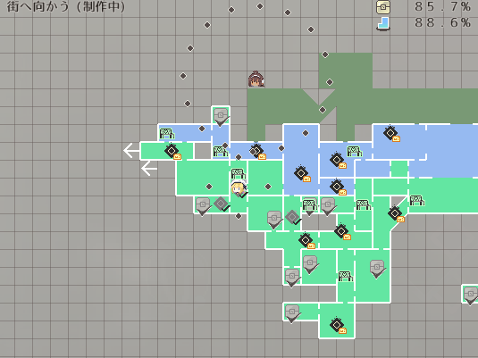
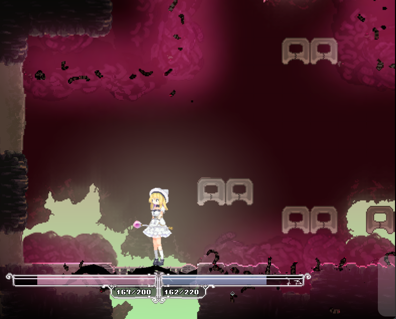

<h2>FAQ</h2>

### ホーリーバースト

Q：ホーリーバーストが何度も取得だけれど、それはバグですか？ 
A：~~作者さんが三か月間頑張って作ってくれたので、みんなで一緒にその成果を見てあげましょう。~~ 
ver 0.22a (221230)お試しの仮置き期間が終わりました。正規の位置に配置されたので旧バージョンのセーブでは再取得する必要があります。

### ベンチが二つ

Q：マップのベンチが二つになっている。 
A：それはver0.09時のベンチと現在0.20のベンチが重なっているのが原因です。 
~~それは重大なバグじゃないから、次の大型アプデまでは修正しません~~ 
ver 0.20n (220521)より修正されました

### サイクロンスラッシュで壁登り

Q：サイクロンスラッシュが色んな場所を壁登り出来る 
A：とある壺男の真似ができます。それは重大なバグではないため、次の大型アプデまでは修正しません。
壺ノエルになって、壁の上の宝箱を目指そう~~ 
ver 0.22a (221230)より修正されました 
私達が失敗と呼ぶものは、落ちる事ではなく、落ちたままでいるということだ。

### 剣山汚染体の拳動がおかしい

Q:ドッグランの剣山汚染体の拳動がおかしい 
A:作者さんより、プログラミングが重大な欠陥があるため、~~次の大型アプデに修正される予定です~~ 
ver 0.21a (220908)より修正されました

### ナイチンゲールさん

Q：ナイチンゲールさんがおかしい所に行った

A:それは仕様です

### ここはどうやって入ってるの

Q：扉が開かない

A：危険度を上げて夜になると、右上で夜戦が可能になります。倒すと扉が開きます
