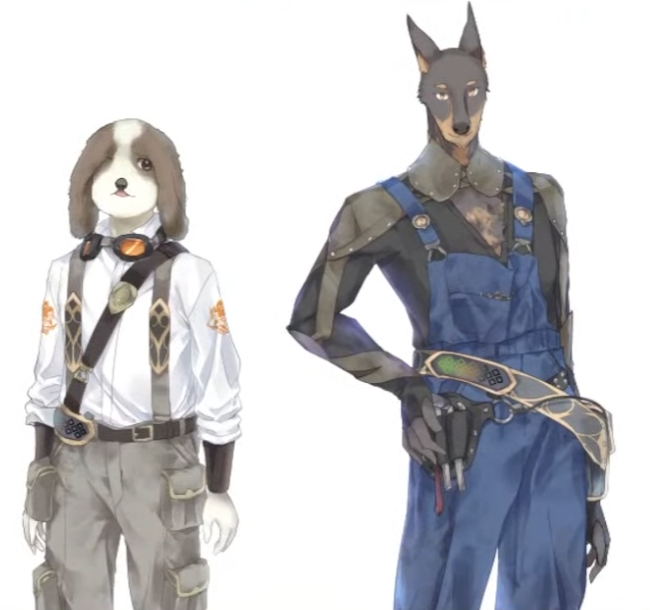
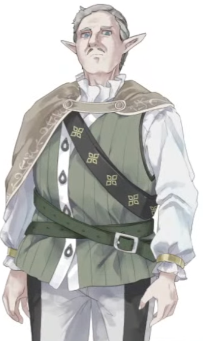

<h2>愛麗搖籃進度如何</h2>

這裡是關於#愛麗搖籃進度如何 
將hinayua & 橋野mizuha製作進度大集結的頁面 
可能會有遊戲內據漏或R18色色的要素 
使用連結到推特

- 220511 [梯子和高樓風](https://twitter.com/HashinoMizuha/status/1524053857407741952)
- 220515 [突風](https://twitter.com/HashinoMizuha/status/1525508612336275456)
- 220519 [風](https://twitter.com/HashinoMizuha/status/1526962264971980800)
- 220523 [扒衣後戰鬥動作](https://twitter.com/hinayua_r18/status/1528700145696899076)
- 220526 [被蟲吃掉(扒衣)](https://twitter.com/hinayua_r18/status/1529715013594025984)
- 220531 [頭上被一吸一吸](https://twitter.com/hinayua_r18/status/1531548917888090112)
- 220601 [下面一吸一吸→上下一吸一吸](https://twitter.com/hinayua_r18/status/1531813127775326208)
- 220601 [掃地的哥哥](https://twitter.com/HashinoMizuha/status/1532000952890273792)
- 220602 [青蛙先生和埋進地板的諾艾爾醬](https://twitter.com/hinayua_r18/status/1532190117145628672)
- 220603 [埋進地板的諾艾爾醬（戰鬥不能時）](https://twitter.com/hinayua_r18/status/1532559558283251712)
- 220604 [🐸青蛙先生的生吞](https:/twitter.com/hinayua_r18/status/1532894344415711232)
- 220606 [伊庫夏▲](https://twitter.com/hinayua_r18/status/1533658760098349056)
- 220607 [伊庫夏▲(累趴)](https://twitter.com/hinayua_r18/status/1533956649492176901)
- 220615 [南丁格爾自○草圖](https://twitter.com/hinayua_r18/status/1537020364794245121)
- 220616 [生吞動畫](https://twitter.com/hinayua_r18/status/1537386866986872833)
- 220623 [粉毛女孩](https://twitter.com/hinayua_r18/status/1539960800034492416)
- 220711 [泡泡](https://twitter.com/hinayua_r18/status/1546175188274151425)
- 220721 [點陣圖:梯子上發射魔法](https://twitter.com/HashinoMizuha/status/1549792411592732672)
- 220724 [動畫鰻魚](https://twitter.com/hinayua_r18/status/1550874401901789184)
- 220726 [代碼重構](https://twitter.com/HashinoMizuha/status/1551583432656175104)
- 220727 [衝刺攻擊](https://twitter.com/HashinoMizuha/status/1551960777157775361)
- 220729 [上梯子](https://twitter.com/HashinoMizuha/status/1552697137292800000)
- 220731 [站立著的諾艾爾](https://twitter.com/HashinoMizuha/status/1553729154168008705)
- 220804 [奇怪的粉色房間(ci-en)](https://ci-en.dlsite.com/creator/12611/article/685357)&[fantia](https://fantia.jp/posts/1406133)
- 220806 [合對形狀解謎](https://twitter.com/HashinoMizuha/status/1555757542177128450)
- 220812 [蹲下護盾](https://twitter.com/HashinoMizuha/status/1557771568046313472)
- 220823 [溺水動作(臥倒)](https://twitter.com/hinayua_r18/status/1562069723084632064)
- 220825 [物品快捷列](https://twitter.com/hinayua_r18/status/1562756627144458242)
- 220826 [地圖擴大／戰鬥場資訊](https://twitter.com/HashinoMizuha/status/1563069542217031680)
- 220829 [減益剩餘時間](https://twitter.com/HashinoMizuha/status/1564224641597509633)
- 220831 [作業台（依據製作的次數所需材料將增加）](https://twitter.com/HashinoMizuha/status/1564910293217513473)
- 220906 [戰敗橋段WIP(半成品)](https://twitter.com/hinayua_r18/status/1566847414711255040)
- 221003 [終於可以切換使用DirectInput/XInput了或許...](https://twitter.com/HashinoMizuha/status/1576892314089234433)
- 221007 [視覺圖（DLSite用)](https://twitter.com/hinayua_r18/status/1578070679852703744)
- 221007 [第一部視覺圖ci-en](https://ci-en.dlsite.com/creator/12611/article/719262)&[fantia](https://fantia.jp/posts/1516468)
- 221022 [下次會增加地男性群](https://twitter.com/HashinoMizuha/status/1583490388626591745)
- 221024 取自(八美大叔顏色)[【Gamedev🌱189】バ美おじさん色【Painting】](https://www.youtube.com/watch?v=M6Gg7PBVo1I)  
- 221029 [王國:三角木馬(自走式)](https://twitter.com/hinayua_r18/status/1586223442604744709)
- 221101 [立繪(諾艾爾坐三角木馬)](https://twitter.com/hinayua_r18/status/1587120586261954560)
- 221108 [配角的獸人桑（立繪）](https://twitter.com/HashinoMizuha/status/1589905333916696577)
- 221109 [被陷阱戲弄的諾艾爾](https://twitter.com/hinayua_r18/status/1590292969739153409)
- 221112 [冰凍狀態](https://twitter.com/hinayua_r18/status/1591340165465001987)
- 221114 [配角（站姿點陣圖）](https://twitter.com/HashinoMizuha/status/1591835185683009536)
- 221115 [死 亡 的 絕 頂　光 束](https://twitter.com/hinayua_r18/status/1592439476781215744)
- 221117 [靜畫線搞](https://twitter.com/HashinoMizuha/status/1592918840996163585)
- 221119 [救出](https://twitter.com/hinayua_r18/status/1593833879848497153)
- 221121 [壓倒在地→吊天井固定(ロメロスペシャル)](https://twitter.com/hinayua_r18/status/1594593016131493891)
- 221124 [吊天井固定和蜥蜴]https:/twitter.com/hinayua_r18/status/1595735067845832704
- 221125 [【有聲音／和流血表現觀看請注意】 動作遊戲常會有的壓縮器的關卡設施](https://twitter.com/hinayua_r18/status/1596111691666055171)
- 221127 [【色色／會有聲音】吊天井固定、 從側面看、還是從內褲看](https://twitter.com/hinayua_r18/status/1596773031887925248)
- 221129 [青蛙（埋進地板）](https://twitter.com/hinayua_r18/status/1597560822410399744)
- 221130 [【色色／會有聲音】青蛙🐸先生的生吞(還有凍結)](https://twitter.com/hinayua_r18/status/1597873678905397250)
- 221207 [能量炸彈](https://twitter.com/hinayua_r18/status/1600502466000605184)
- 221210 [這個脫下來的衣服究竟是怎麼一回事呢……！？](https://twitter.com/hinayua_r18/status/1601431562373197829)
- 221216 [新技能和練習場](https://twitter.com/HashinoMizuha/status/1603698771946536960)
- 221217 [【色色／會有聲音】魯莽的挑戰救出的諾艾爾醬VS鑽頭觸手](https://twitter.com/hinayua_r18/status/1604094115817586688)
- 230101 [NSFW【注:會有流血的表現】 頭目向上突起的拘束攻擊(因前一個沒有設定到色情內容所以重新推文）](https://twitter.com/hinayua_r18/status/1609515957449535488)
- 230105 [那個剪影的軍人桑(頭目打完時候的劇情)](https://twitter.com/HashinoMizuha/status/1610674474038472704)
- 230119 [？？？（幽靈）](https://twitter.com/HashinoMizuha/status/1615757387977330688)
- 230124 [各式各樣的表情](https://twitter.com/HashinoMizuha/status/161756282334493900)
- 230201 [幽靈醬蹲下來](https://twitter.com/HashinoMizuha/status/1620461581275660288)
