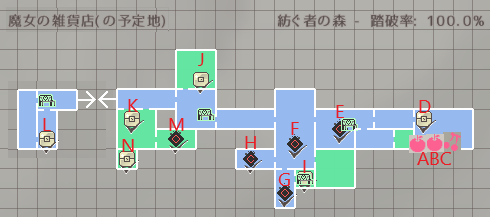

<h2>バージョンからの変更点</h2>

### バージョン0.09

最初のアーリーアクセス版。 
ver0.09では魔術を魔法と呼ぶ 
空きビンは三つ所持できます 
それとマップは全然0.20とは違うので 
ここに0.09のデータをまとめします 
そして伝説へ…

  
ver0.09cn

  

  
|場所|アイテム名|備考|
|---|---|---|
|A|ブラッドアップルx3|採集|
|B|ブラッドアップルx3|採集|
|C|ブラッドチェリーx3|採集|
|D|エナジーボール|魔法|
|E|バイタルグミx10|”木漏れ日の広間”の戦闘報酬|
|F|マジカルグミx10|”きのこを実装したかった場所”の戦闘報酬|
|G|ホーリーバースト|”夕立”の戦闘報酬、魔法|
|H|禁忌のリンゴx3|”はぐれ者”の戦闘報酬|
|I|整頓術x3|夕立の隠し部屋|
|J|グラティアのアンク||
|K|150G||
|L|グラウンドボム|魔女の雑貨店（の予定地）、魔法|
|M|禁忌のリンゴx1|”鳥籠”の戦闘報酬|
|N|ライフボトルx5||

### バージョン0.20

このverからは魔法を魔術と呼ぶ 
それと、いろいろなイベントとストーリーが導入された 
システム的には、料理と宝箱を追加。 
ver 0.20gで危険度最大値を160まで延長。 
剣山のドリル攻撃をシールドバッシュで防げるよう修正。 
天気が風の場合は魔法の移動速度も上昇するよう修正。その代わり、風の際の敵の最大出現数補正を -3 → -2 に変更。 
ボムの設置にかかるスピードを高速化 
{バーストがだんだんナーフされた（状態異常「昏倒」、アイテムを使用できない、使用後に魔力の吸収がロックされる、拘束のぬけにくいとか） 
過去verでは”整頓術”という名前のアイテムが、今verでは”カバン拡張キット”に名前を変更。 

### バージョン0.21

アイテム枯れ草が追加。 
作業台で合成システムが実装、 
このverでは”カバン拡張キット”が存在せず、作業台でアイテム所持数を拡張します 
最初のフェイタルシーンが実装。シーンがリリースを伴うになってシーン回想も実装します 
ゲーム中にセーブデータにメモができます 

### バージョン0.22

新しいエンハンサー5種、スキル2種を追加 
アイテム30個くらい追加 
宝箱7種 
沸きポイント6個と1個ボス戦 
魔族トカゲと沼蛙 
家のトイレUIがリニューアル 
新しい要素に風とはしご 
バーストの取得方法変更 
イベント中、↑でバックログを表示します。また、Cでメッセージを非表示にできます。 
サイクロンスラッシュは壁登りができなくなる、特定の狀況で転倒してしまう 
