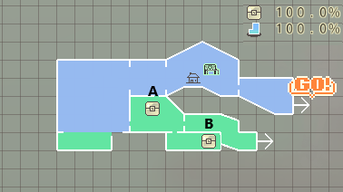
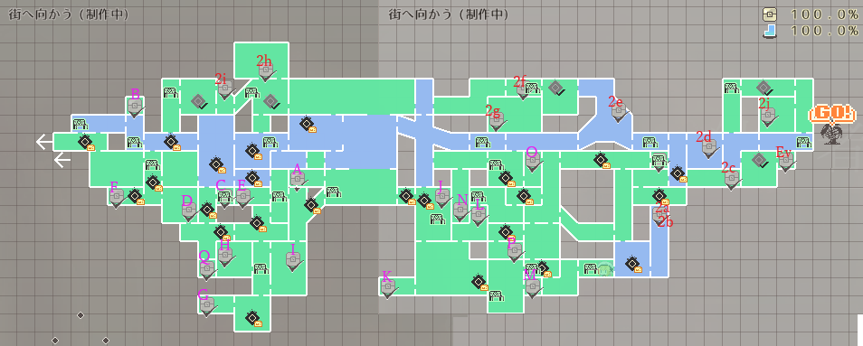

<h2>地圖寶箱</h2>

<!-- images or urls list for this page -->
[強化器]: wiki/zh-hant/table_of_contents/enhancer
[技能]: wiki/zh-hant/table_of_contents/skill
[魔術]: wiki/zh-hant/table_of_contents/spelll

### 魔女的雑貨店

| 場所 | 物品名 | 入手方法 | 備註  |
|---|---|---|---|
| A | 強化器插槽 | 魔女的雑貨店：水井下瀑布有個房間的右邊 | 擴張零件  |
| B | 雙重迴避 | 魔女的雑貨店：水井下最右下角水面下的有一堆水和蟲的隱藏房間 | 強化器零件、需要球型炸彈 |

### 編織者之森

| 場所 | 物品名 | 入手方法 | 備註 |
|---|---|---|---|
| A | 埴輪土偶護身符 | 最一開始的故事在爬懸崖途中左側的岩石破壞、在那房間 | 初期入手可能、沒拿不會影響寶箱完成度 |
| B | 100G | 荊棘橋的右邊、有椅子的地方、破壞天花板的樹 | 初期入手可能 |
| C | 血之虹彩 | 在黄昏驟雨有個隱藏房間 | 強化器零件、初期入手可能 |
| D | 強化器插槽 | 在卑賤的補給兵往下面、之後右邊前進有蟲的房間 | 擴張零件、初期入手可能 |
| E | 護盾衝擊 | 在溜狗區往左邊、有椅子的地方並破壞左邊的岩石 | 需要球型炸彈 |
| F | 長杖 | 在迷途者左邊 | 強化器零件、初期入手可能 |
| G | HP+10 | 伊庫夏救出事件後、土龍的巢穴左邊的房間 | 角色強化 |
| H | 旋風迴轉 | 伊庫夏救出事件後、上面有椅子的地方並破壞左邊的岩石上 | [技能]、需要球型炸彈 |
| I | HP+20 | 跟右下連動的益智房間 | 角色強化、需要能量球 |
| J | 過載魔術 | 酸木的前菜右下荊棘 | 強化器零件 |
| K | 勾索鞋 | 在有滿滿酸液的房間、左下角的門裡面、有水益智解謎的房間 | 強化器零件 |
| L | 下墬貓 | 酸底的針鼠往上面前進、酸液益智解謎的房間 | 強化器零件 |
| M | MP+20 | 注意頭頂椅子的下面 | 角色強化 |
| N | 彗星衝擊 | 有酸液瀑布的通路在途中、下面有個隱藏房間 | [技能]、初期入手可能 |
| O | HP+20 | 有會移動的牆壁益智解謎的房間 | 角色強化、初期入手可能 |
| P | HP+20 | 流鏑馬的聚集左下角通路的益智解謎的房間 | 角色強化 |
| Q | 充電器插槽 | 盒子裡的傑克(夜)擊破之後、左下角蟲堆內的隱藏房間 | 重要品、沒有辦法回去，請注意HP |
| 2a | 笨拙者的潛力 | 以前有聖光爆發的狐狸站右側 | [強化器] |
| 2b | MP+20 | 和2右車站右側角的電流爬梯關卡 | 角色強化 |
| 2c | 衝刺強襲 | 右車站右下角的解謎 | [技能]、初期入手可能 |
| 2d | 軌道護盾 | 右車站右側角的電流柱關卡 | [技能] |
| 2e | HP+10 | 荊棘和梯子的刺刺迷宮 | 角色強化 |
| 2f | 盜壘王的腳 | 將大岩爆破後、荊棘和梯子的刺刺迷宮最上方左邊的房間 | [強化器] |
| 2g | 懼高症 | 從精靈之里入手往右邊到底有酸湖右側的牆壁炸開 | [強化器] |
| 2h | 空中斬 | 吹著風的關卡 | [技能] |
| 2i | 濕潤的預兆 | 青蛙擊破後地圖從左側到上面 | [強化器] |
| 2j | 祈雨護身符 | 在頭目右側懸崖靠左邊的牆裡 | [強化器] |

### Event

| 地點 | 物品名 | 入手方法 | 備註  |
|---|---|---|---|
| 蛇戦（土龍之巢） | 能量球 | 將蛇頭目打倒後伊庫夏所給的 | [魔術]  |
| 頭目戰之後右下角的椅子	 | 強化器插槽x2 | 頭目打倒後的戰利品 | 擴張零件  |
